# Survey quantiles with dummy sample
Sara Hänzi
14 Aug 2023

# Preparation

package loads

``` r
library(survey)
library(dplyr)
library(ggplot2)
library(patchwork)
```

check survey version

``` r
packageVersion("survey")
```

    [1] '4.2.1'

define quantiles to be estimated, some not-quite-straightforward numbers
as some examples only pop up with special cases

``` r
quantiles <- c(0.01, 0.05, 0.1, 0.15, seq(21, 81, 10)*0.01, 0.85, 0.9, 0.95, 0.99)
```

source all functions

``` r
source("functions_for_estimation_and_plotting.R")
```

# No stratification

dummy population with N = n = 10

## prepare data and design

``` r
data_no_strat <- data.frame(x = 1:10, id = 1:10, fpc = 10, probs = 1)

design_no_strat <- svydesign(id = ~id, 
                             probs = ~probs, 
                             data = data_no_strat, 
                             fpc = ~fpc)
```

## example call

``` r
res <- svyquantile(~x, design_no_strat, quantiles, ci = TRUE,
            interval.type = "mean", qrule = "hf1")
```

Plot the estimated quantiles (the color indicates how many NAs are
present in the confidence limits). The confidence interval is plotted in
shaded gray as an area, however this is not visible when the interval is
the same as the quantile estimate (which is the expected behaviour here
as everything is known).

``` r
quant_df <- quant_to_df(res, quantiles)
plot_quantile_ci(quant_df, "mean and hf1")
```

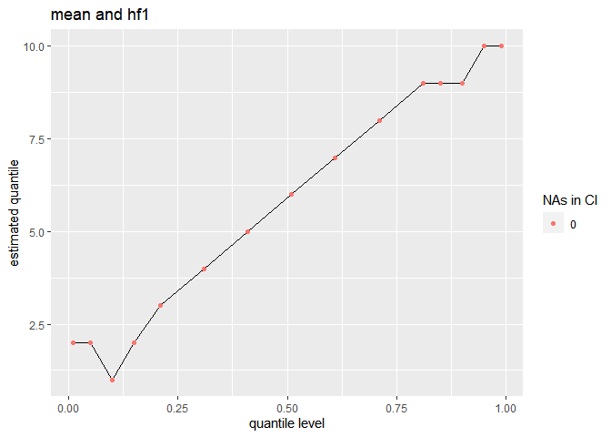

get the proportion that for which it is true that x \>= the estimated
quantile; checking this as this seems to be used in the implementation
for the estimation of the confidence intervals

``` r
a <- purrr::map(quant_df$quantile, .f = \(z) survey::svymean(~ x <= z, design_no_strat)) %>% 
  purrr::map_dbl(2)

plot_prop_quantile(quant_df$level, a)
```

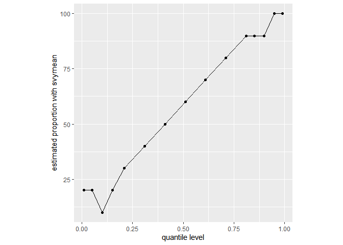

## loop over different combinations

do for different versions / combinations of `interval_type` and `qrule`

### with newsvyquantile

``` r
quantile_plot_loop(design_no_strat, quantiles, 
                   qrules = c("hf1", "hf7", "hf8"),
                   interval_types = c("mean", "beta", "xlogit"))
```

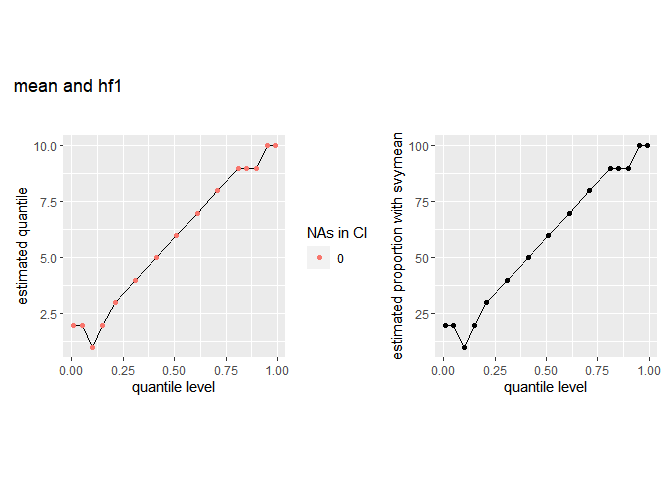

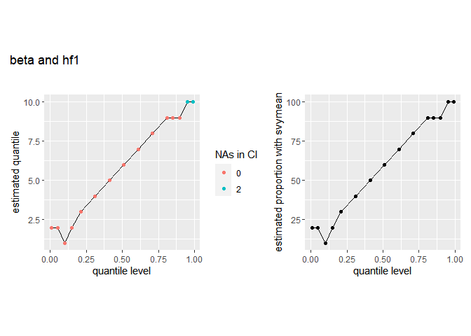

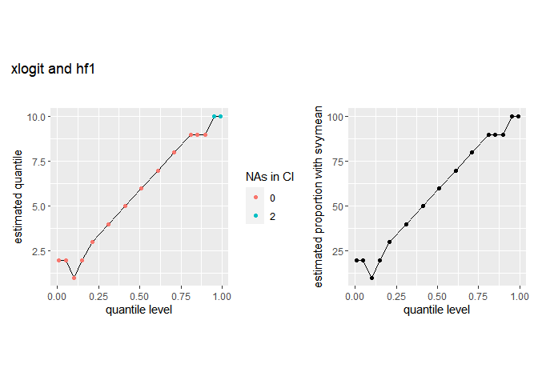


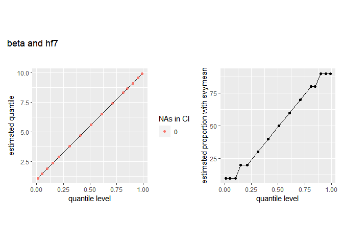

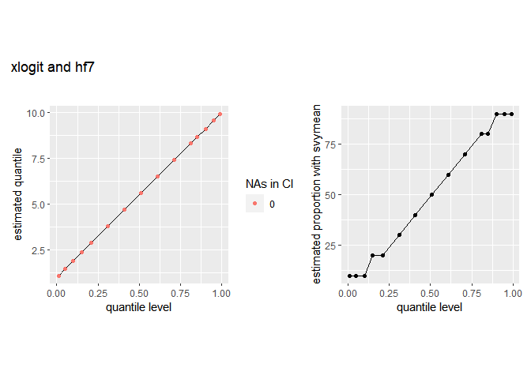

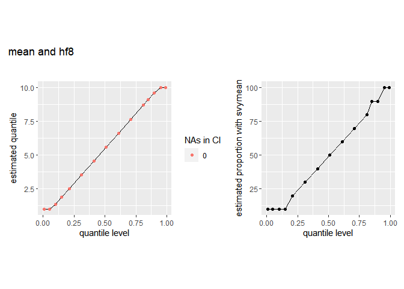

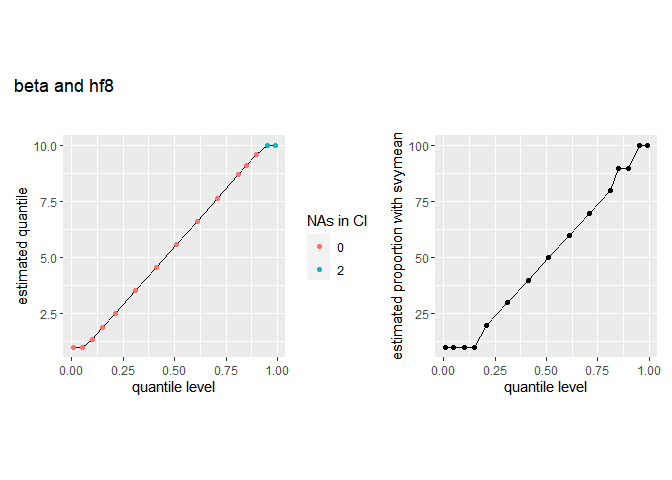

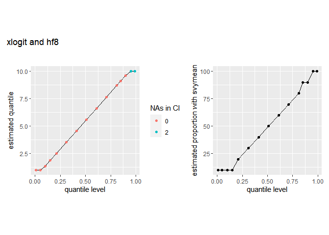

### with oldsvyquantile

``` r
old_quantile_plot_loop(design_no_strat, quantiles,
                       ties = c("discrete", "rounded"),
                       interval_types = c("Wald", "betaWald"))
```


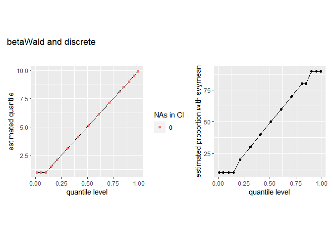

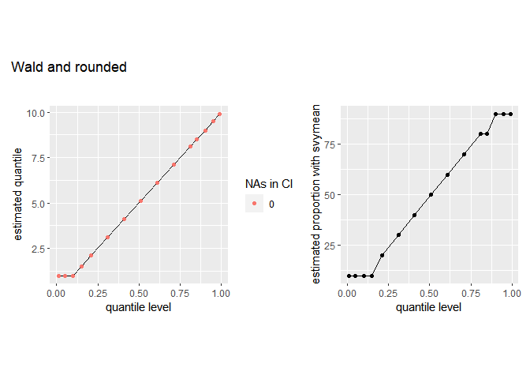


# dummy population with stratification

overall: n = 20, N = 110

stratum 1: n = 10, N = 10, everything is known

stratum 2: n = 10, N = 100

``` r
data_strat <- data.frame(x = c(1:10, 1:10), id = 1:20, 
                         strata =  c(rep(1, 10), rep(2,10)),
                         fpc = c(rep(10, 10), rep(100, 10)), 
                         probs = c(rep(1, 10),rep(0.1,10)))

design_strat <- svydesign(id = ~id, 
                          strata = ~strata,
                          probs = ~probs,
                          data = data_strat, 
                          fpc = ~fpc)
```

## example call

``` r
res <- svyquantile(~x, design_strat, quantiles, ci = TRUE,
            interval.type = "mean", qrule = "hf1")

res
```

    $x
         quantile ci.2.5 ci.97.5       se
    0.01        1    NaN       3      NaN
    0.05        1    NaN       3      NaN
    0.1         1    NaN       3      NaN
    0.15        2    NaN       5      NaN
    0.21        3      1       6 1.189954
    0.31        4      2       7 1.189954
    0.41        5      2       9 1.665935
    0.51        6      4       9 1.189954
    0.61        7      5      10 1.189954
    0.71        8      6     NaN      NaN
    0.81        9      8     NaN      NaN
    0.85        9      8     NaN      NaN
    0.9         9      8     NaN      NaN
    0.95       10     10      10 0.000000
    0.99       10     10      10 0.000000

    attr(,"hasci")
    [1] TRUE
    attr(,"class")
    [1] "newsvyquantile"

Plot the quantiles and their confidence intervals. Again, the color
indicates how many NAs are present in the confidence limits and the
confidence interval is plotted in shaded gray as an area.

``` r
quant_df <- quant_to_df(res, quantiles)
plot_quantile_ci(quant_df, "mean and hf1")
```


### loop with new svyquantile

``` r
quantile_plot_loop(design_strat, quantiles,
                   qrules = c("hf1", "hf7", "hf8"),
                   interval_types = c("mean", "beta", "xlogit"))
```


### loop with old svyquantile

``` r
old_quantile_plot_loop(design_strat, quantiles,
                       ties = c("discrete", "rounded"),
                       interval_types = c("Wald", "betaWald"))
```


