# Survey quantiles with dummy sample
Sara Hänzi
11 Aug 2023

# Preparation

package loads

``` r
library(survey)
library(dplyr)
library(ggplot2)
library(patchwork)
```

check survey version

``` r
packageVersion("survey")
```

    [1] '4.2.1'

define quantiles to be estimated, some not-quite-straightforward numbers
as some examples only pop up with special cases

``` r
quantiles <- c(0.01, 0.05, 0.1, 0.15, seq(21, 81, 10)*0.01, 0.85, 0.9, 0.95, 0.99)
```

function for reshaping the quantiles as output by survey

``` r
quant_to_df <- function(res, quantile_levels){
  res_df <- data.frame(quantile = res$x[, "quantile"],
                       lwr = res$x[, "ci.2.5"],
                       upr = res$x[, "ci.97.5"],
                       se = res$x[, "se"],
                       level = quantile_levels)
 return(res_df)
}
```

and the same for the output from the oldsvyquantile

``` r
quant_to_df_old <- function(res, quantile_levels){
  res_df <- data.frame(quantile = t(res$quantiles)[,"x"],
                       lwr = confint(res)[, 1],
                       upr = confint(res)[, 2],
                       level = quantile_levels)
 return(res_df)
}
```

function to plot the quantiles and their ci

``` r
plot_quantile_ci <- function(data, title) {
  data |> 
    mutate(na_flag = case_when((is.na(lwr) & is.na(upr)) == TRUE ~ 2,
                               (is.na(lwr) | is.na(upr)) == TRUE ~ 1,
                               .default = 0)) |> 
    ggplot(aes(x = level)) +
    geom_ribbon(aes(ymin = lwr, ymax = upr), fill = "#D6D6D6") +
    geom_line(aes(y = quantile)) +
    geom_point(aes(y = quantile, color = factor(na_flag))) +
    labs(title = title,
         x = "quantile level",
         y = "estimated quantile",
         color = "NAs in CI")
}
```

function to plot quantile levels vs. proportion we get at the estimated
quantile

``` r
plot_prop_quantile <- function(quantile_levels, proportion){
  tibble(levels = quantile_levels, prop = proportion * 100) %>% 
  ggplot(aes(x = levels, y = prop)) +
    geom_line() +
    geom_point() +
    labs(x = "quantile level", y = "estimated proportion with svymean") +
    theme(aspect.ratio = 1)
}
```

function to go over all combinations of qrule and interval_type for new
svyquantile

``` r
quantile_plot_loop <- function(design, quantiles, qrules = c("hf1", "hf7", "hf8"), 
                               interval_types = c("mean", "beta", "xlogit")){
  
  for (qrule in qrules){
    for (interval_type in interval_types){
      res <- svyquantile(~x, design, quantiles, ci = TRUE,
            interval.type = interval_type, qrule = qrule)
      
      quant_df <- quant_to_df(res, quantiles)
      # plot quantiles and ci
      p_quant_ci <- plot_quantile_ci(quant_df, 
                                title = "")
      # calculate and plot proportions at the estimated quantiles
      prop <- purrr::map(quant_df$quantile, .f = \(z) survey::svymean(~ x <= z, design)) %>% 
        purrr::map_dbl(2)
      p_prop <- plot_prop_quantile(quant_df$level, prop)
      
      print(p_quant_ci + p_prop + plot_annotation(paste(interval_type, "and", qrule)))
      
    }
  }
}
```

loop for old svyquantile

``` r
old_quantile_plot_loop <- function(design, quantiles, ties = c("discrete", "rounded"), 
                               interval_types = c("Wald", "betaWald")){
  
  for (tie in ties){
    for (interval_type in interval_types){
      res <- oldsvyquantile(~x, design, quantiles, ci = TRUE,
            interval.type = interval_type, tie = tie)
      
      quant_df <- quant_to_df_old(res, quantiles)
      # plot quantiles and ci
      p_quant_ci <- plot_quantile_ci(quant_df, 
                                title = "")
      # calculate and plot proportions at the estimated quantiles
      prop <- purrr::map(quant_df$quantile, .f = \(z) survey::svymean(~ x <= z, design)) %>% 
        purrr::map_dbl(2)
      p_prop <- plot_prop_quantile(quant_df$level, prop)
      
      print(p_quant_ci + p_prop + plot_annotation(paste(interval_type, "and", tie)))
      
    }
  }
}
```

# No stratification

dummy population with N = n = 10

## prepare data and design

``` r
data_no_strat <- data.frame(x = 1:10, id = 1:10, fpc = 10, probs = 1)

design_no_strat <- svydesign(id = ~id, 
                             probs = ~probs, 
                             data = data_no_strat, 
                             fpc = ~fpc)
```

## example call

``` r
res <- svyquantile(~x, design_no_strat, quantiles, ci = TRUE,
            interval.type = "mean", qrule = "hf1")
```

``` r
quant_df <- quant_to_df(res, quantiles)
plot_quantile_ci(quant_df, "mean and hf1")
```

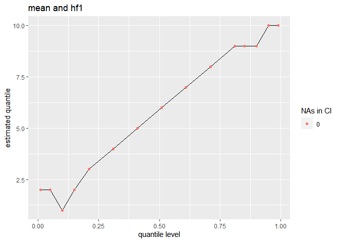

get the proportion that for which it is true that x \>= the estimated
quantile

``` r
a <- purrr::map(quant_df$quantile, .f = \(z) survey::svymean(~ x <= z, design_no_strat)) %>% 
  purrr::map_dbl(2)

plot_prop_quantile(quant_df$level, a)
```

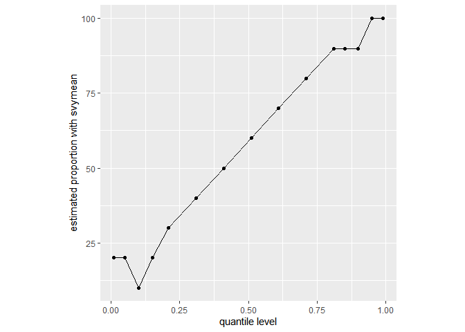

## loop over different combinations

do for different versions / combinations of `interval_type` and `qrule`

### with newsvyquantile

``` r
quantile_plot_loop(design_no_strat, quantiles)
```

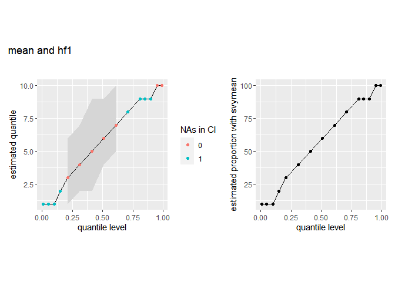

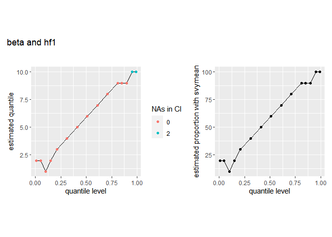

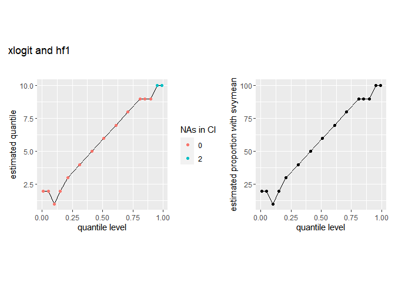

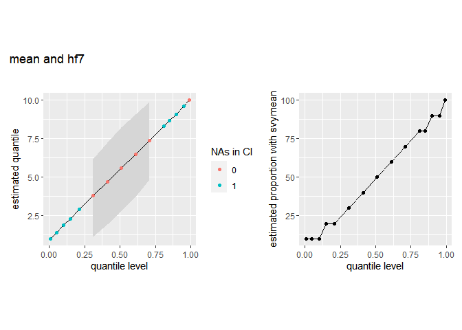

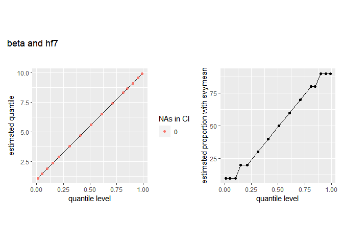

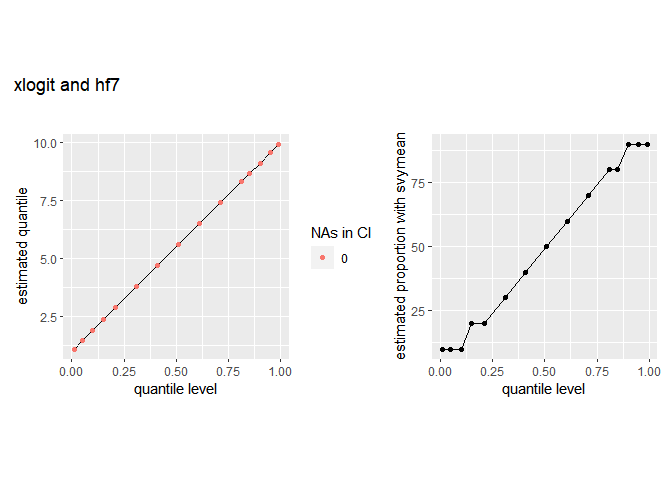

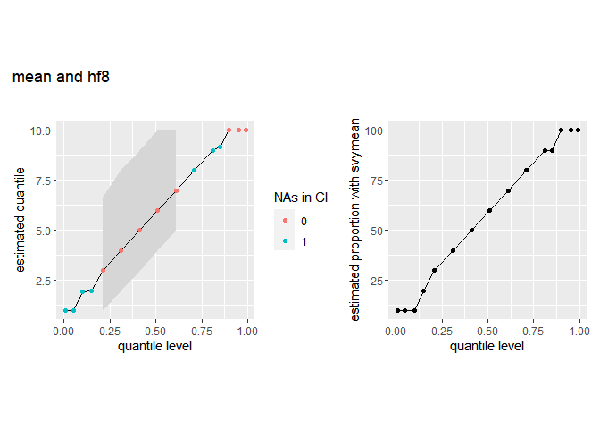

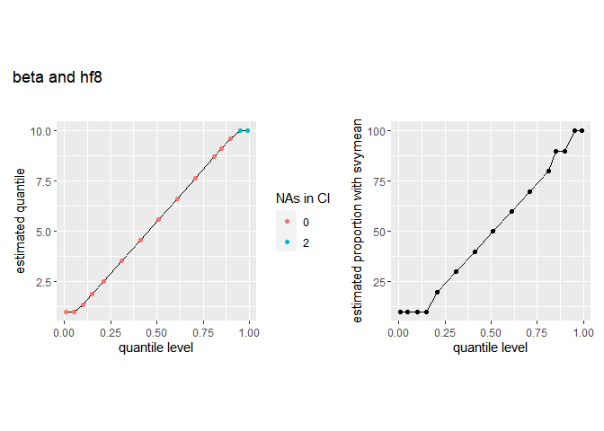

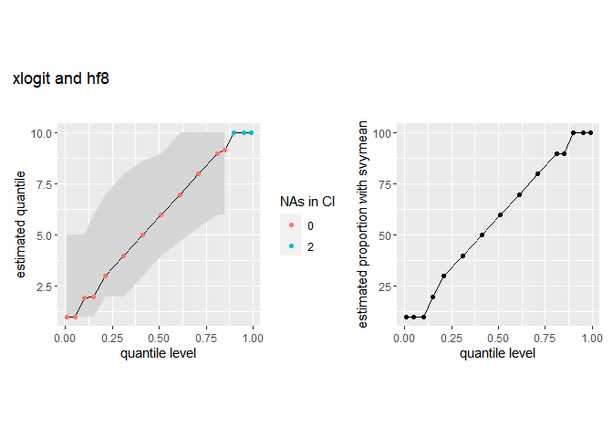

### with oldsvyquantile

``` r
old_quantile_plot_loop(design_no_strat, quantiles)
```


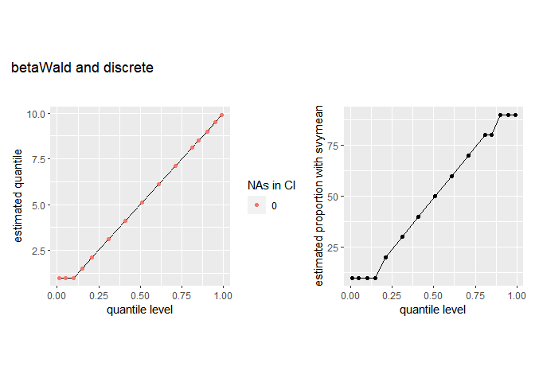

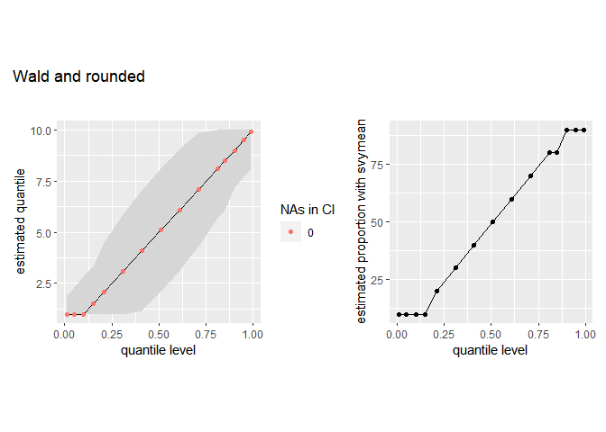


# dummy population with stratification

overall: n = 20, N = 110

stratum 1: n = 10, N = 10, everything is known

stratum 2: n = 10, N = 100

``` r
data_strat <- data.frame(x = c(1:10, 1:10), id = 1:20, 
                         strata =  c(rep(1, 10), rep(2,10)),
                         fpc = c(rep(10, 10), rep(100, 10)), 
                         probs = c(rep(1, 10),rep(0.1,10)))

design_strat <- svydesign(id = ~id, 
                          strata = ~strata,
                          probs = ~probs,
                          data = data_strat, 
                          fpc = ~fpc)
```

## example call

``` r
res <- svyquantile(~x, design_strat, quantiles, ci = TRUE,
            interval.type = "mean", qrule = "hf1")

res
```

    $x
         quantile ci.2.5 ci.97.5       se
    0.01        1    NaN       3      NaN
    0.05        1    NaN       3      NaN
    0.1         1    NaN       3      NaN
    0.15        2    NaN       5      NaN
    0.21        3      1       6 1.189954
    0.31        4      2       7 1.189954
    0.41        5      2       9 1.665935
    0.51        6      4       9 1.189954
    0.61        7      5      10 1.189954
    0.71        8      6     NaN      NaN
    0.81        9      8     NaN      NaN
    0.85        9      8     NaN      NaN
    0.9         9      8     NaN      NaN
    0.95       10     10      10 0.000000
    0.99       10     10      10 0.000000

    attr(,"hasci")
    [1] TRUE
    attr(,"class")
    [1] "newsvyquantile"

``` r
quant_df <- quant_to_df(res, quantiles)
plot_quantile_ci(quant_df, "mean and hf1")
```

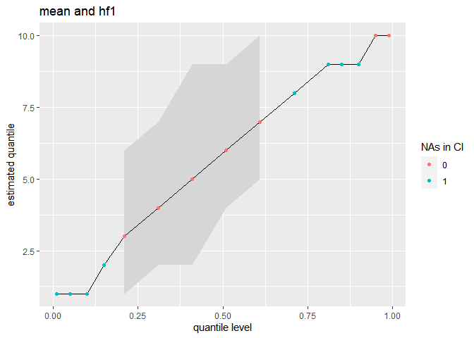

### loop with new svyquantile

``` r
quantile_plot_loop(design_strat, quantiles)
```


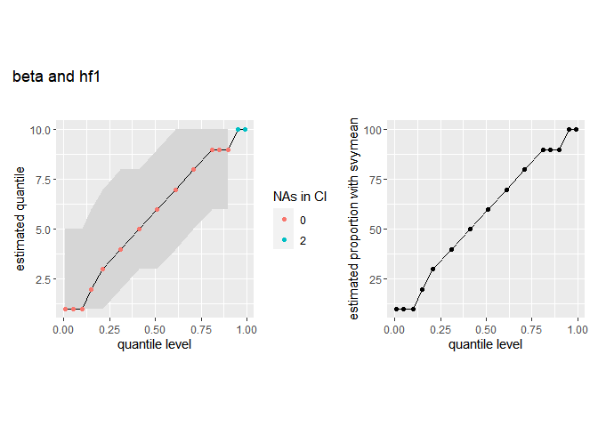


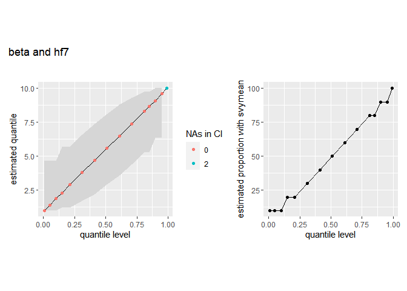


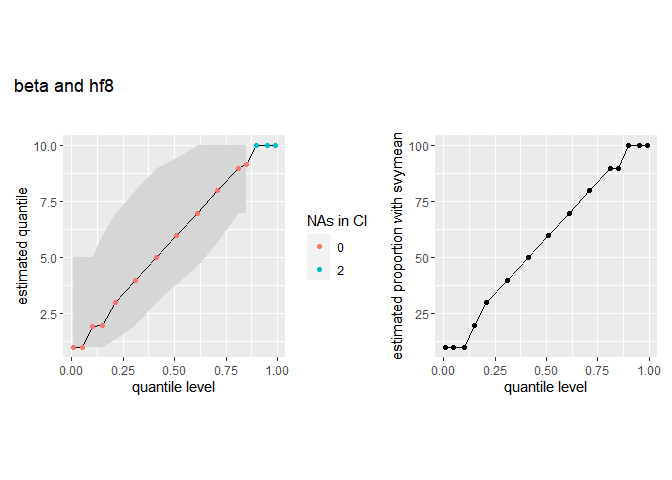


### loop with old svyquantile

``` r
old_quantile_plot_loop(design_strat, quantiles)
```

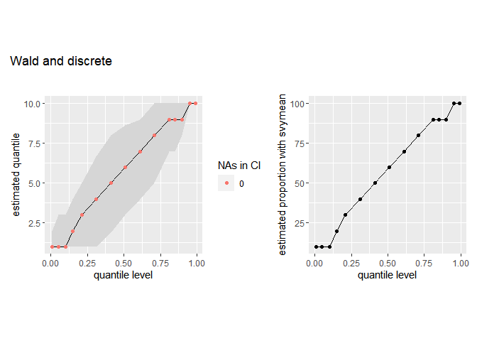

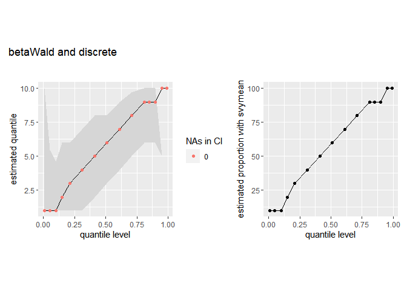


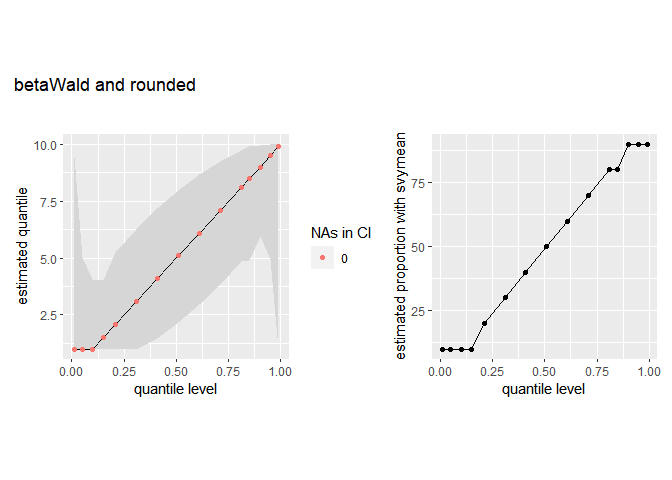
